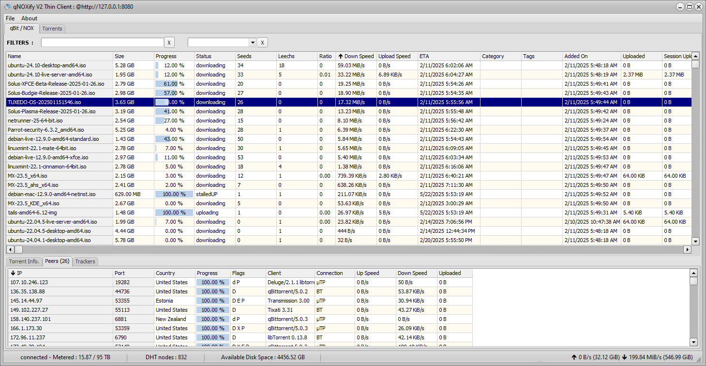
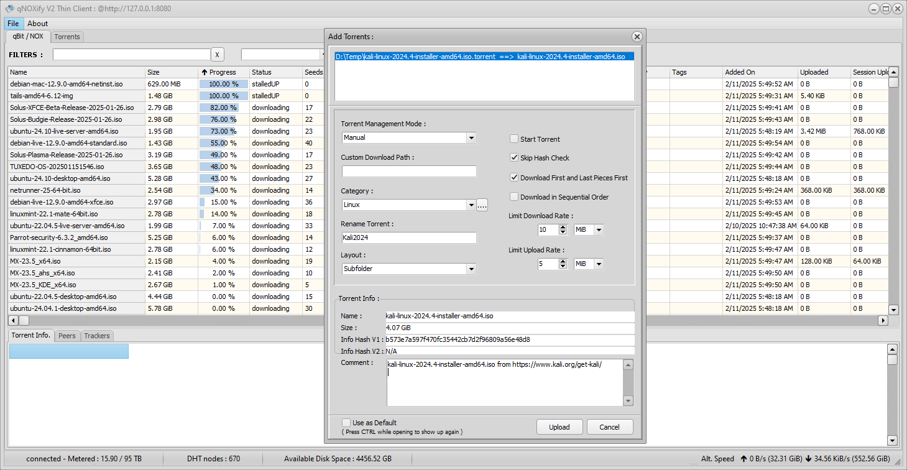
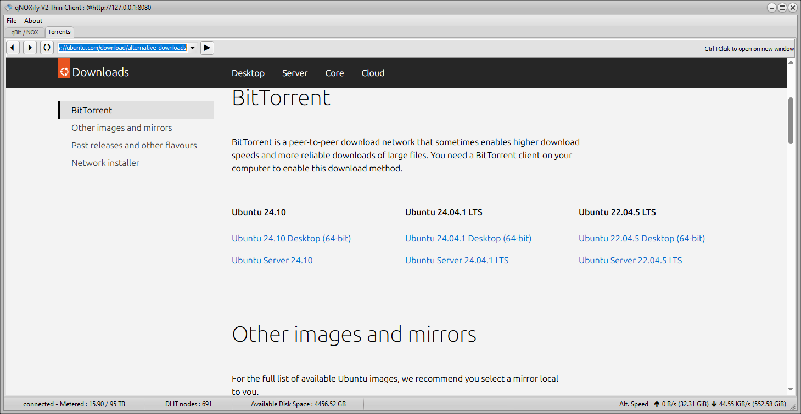

# qBit4DelphiV2 API + qNOXify V2
An API to drive any qBittorent/NOX server form Delphi (100% Pure Pascal). It is based on the JsonX4 project.(https://github.com/bnzbnz/JsonX4)

> It includes qNOXify V2 a qNOX client for qBittorrent and mainly NOX servers (SeedBox)

- This project is sponsored by EA4D "Ebay Api 4 Delphi" (https://www.ea4d.com) for JsonX4.
- Contact : Laurent MEYER  qBit@lmeyer.fr

This package contains also :
- TTorrentReader: a torrent file parser (UTF8 BEncode, Format: V1, V2 and Hybrid).
- TIP_API : an interface to ip-api.com to get any IP data
- uCountryFlags: country flags .png images from app. resources (ISO 639)

How to install
--------------
1. Clone qBid4DelphiX2 own repository (JsonX4 units are included), you will be able too run any of the Demos.
3. Please note, that you need to enable the WebUI in qBittorrent/NOX preferences.





List of Calls:
--------------

```Delphi

  /////////////////////////////////////////////////////////////////////////////////////////
  // WebAPI: https://github.com/qbittorrent/qBittorrent/wiki/WebUI-API-(qBittorrent-4.1) //
  /////////////////////////////////////////////////////////////////////////////////////////

  // Authentication :
        // https://github.com/qbittorrent/qBittorrent/wiki/WebUI-API-(qBittorrent-4.1)#login
    function Login(Username, Password: string): Boolean; virtual;
        // https://github.com/qbittorrent/qBittorrent/wiki/WebUI-API-(qBittorrent-4.1)#logout
    function Logout: Boolean; virtual;

  // Application :
        // https://github.com/qbittorrent/qBittorrent/wiki/WebUI-API-(qBittorrent-4.1)#get-application-version
    function GetVersion: string; virtual;
        // https://github.com/qbittorrent/qBittorrent/wiki/WebUI-API-(qBittorrent-4.1)#get-api-version
    function GetAPIVersion: string; virtual;
        // https://github.com/qbittorrent/qBittorrent/wiki/WebUI-API-(qBittorrent-4.1)#get-build-info
    function GetBuildInfo: TqBitBuildInfoType; virtual;
        // https://github.com/qbittorrent/qBittorrent/wiki/WebUI-API-(qBittorrent-4.1)#shutdown-application
    function Shutdown: Boolean; virtual;
        // https://github.com/qbittorrent/qBittorrent/wiki/WebUI-API-(qBittorrent-4.1)#get-application-preferences
    function GetPreferences: TqBitPreferencesType; virtual;
        // https://github.com/qbittorrent/qBittorrent/wiki/WebUI-API-(qBittorrent-4.1)#set-application-preferences
    function SetPreferences(Prefs: TqBitPreferencesType): boolean; virtual;
        // https://github.com/qbittorrent/qBittorrent/wiki/WebUI-API-(qBittorrent-4.1)#get-default-save-path
    function GetDefaultSavePath: string; virtual;
       // UNDOCUMENTED
    function GetNetworkInterfaces: TqBitNetworkInterfacesType;
        // UNDOCUMENTED
    function GetNetworkInterfaceAddress(Iface: string = ''): TqBitNetworkInterfaceAddressesType;

  // Log :
        // https://github.com/qbittorrent/qBittorrent/wiki/WebUI-API-(qBittorrent-4.1)#log
    function GetLog(LastKnownId: int64 = -1; Normal: boolean = false;
              Info: boolean = false; Warning: boolean = true; Critical: boolean = true) : TqBitLogsType; virtual;
        // https://github.com/qbittorrent/qBittorrent/wiki/WebUI-API-(qBittorrent-4.1)#get-peer-log
    function GetPeerLog(LastKnownId: int64 = -1): TqBitPeerLogsType; virtual;

  // Sync :
        // https://github.com/qbittorrent/qBittorrent/wiki/WebUI-API-(qBittorrent-4.1)#get-main-data
    function GetMainData(Rid: int64 = 0): TqBitMainDataType; virtual;
        // https://github.com/qbittorrent/qBittorrent/wiki/WebUI-API-(qBittorrent-4.1)#get-torrent-peers-data
    function GetTorrentPeersData(Hash: string; Rid: int64 = 0): TqBitTorrentPeersDataType; virtual;

  // Transfer :
        // https://github.com/qbittorrent/qBittorrent/wiki/WebUI-API-(qBittorrent-4.1)#get-global-transfer-info
    function GetGlobalTransferInfo: TqBitGlobalTransferInfoType; virtual;
        // https://github.com/qbittorrent/qBittorrent/wiki/WebUI-API-(qBittorrent-4.1)#get-alternative-speed-limits-state
    function GetAlternativeSpeedLimitsState: boolean; virtual;
        // https://github.com/qbittorrent/qBittorrent/wiki/WebUI-API-(qBittorrent-4.1)#toggle-alternative-speed-limits
    function ToggleAlternativeSpeedLimits: boolean; virtual;
        // https://github.com/qbittorrent/qBittorrent/wiki/WebUI-API-(qBittorrent-4.1)#get-global-download-limit
    function GetGlobalDownloadLimit: integer; virtual;
        // https://github.com/qbittorrent/qBittorrent/wiki/WebUI-API-(qBittorrent-4.1)#set-global-download-limit
    function SetGlobalDownloadLimit( GlobalDownloadLimit: integer): boolean; virtual;
        // https://github.com/qbittorrent/qBittorrent/wiki/WebUI-API-(qBittorrent-4.1)#set-global-upload-limit
    function GetGlobalUploadLimit: integer; virtual;
        // https://github.com/qbittorrent/qBittorrent/wiki/WebUI-API-(qBittorrent-4.1)#get-global-upload-limit
    function SetGlobalUploadLimit(GlobalUploafimit: integer): boolean; virtual;
       // https://github.com/qbittorrent/qBittorrent/wiki/WebUI-API-(qBittorrent-4.1)#ban-peers
    function BanPeers(PeerListStr: string): boolean; overload; virtual;

  // Torrent management :
        // https://github.com/qbittorrent/qBittorrent/wiki/WebUI-API-(qBittorrent-4.1)#get-torrent-list
    function GetTorrentList(TorrentListRequest : TqBitTorrentListRequestType): TqBitTorrentsListType; virtual;
        // https://github.com/qbittorrent/qBittorrent/wiki/WebUI-API-(qBittorrent-4.1)#get-torrent-generic-properties
    function GetTorrentGenericProperties(Hash: string): TqBitTorrentInfoType; virtual;
        // https://github.com/qbittorrent/qBittorrent/wiki/WebUI-API-(qBittorrent-4.1)#get-torrent-trackers
    function GetTorrentTrackers(Hash: string): TqBitTrackersType; virtual;
        // https://github.com/qbittorrent/qBittorrent/wiki/WebUI-API-(qBittorrent-4.1)#get-torrent-web-seeds
    function GetTorrentWebSeeds(Hash: string): TqBitWebSeedsType; virtual;
        // https://github.com/qbittorrent/qBittorrent/wiki/WebUI-API-(qBittorrent-4.1)#get-torrent-contents
    function GetTorrentContents(Hash: string; Indexes: string = ''): TqBitContentsType;  virtual;
        // https://github.co m/qbittorrent/qBittorrent/wiki/WebUI-API-(qBittorrent-4.1)#get-torrent-pieces-states
    function GetTorrentPiecesStates(Hash: string): TqBitPiecesStatesType; virtual;
       // https://github.com/qbittorrent/qBittorrent/wiki/WebUI-API-(qBittorrent-4.1)#pause-torrents
    function StopTorrents(Hashes: string = 'all'): boolean; overload; virtual;
          // https://github.com/qbittorrent/qBittorrent/wiki/WebUI-API-(qBittorrent-4.1)#resume-torrents
    function StartTorrents(Hashes: string = 'all'): boolean; overload; virtual;
        // https://github.com/qbittorrent/qBittorrent/wiki/WebUI-API-(qBittorrent-4.1)#delete-torrents
    function DeleteTorrents(Hashes: string; DeleteFiles: boolean = False): boolean; overload; virtual;
        // https://github.com/qbittorrent/qBittorrent/wiki/WebUI-API-(qBittorrent-4.1)#recheck-torrents
    function RecheckTorrents(Hashes: string): boolean; overload; virtual;
        // https://github.com/qbittorrent/qBittorrent/wiki/WebUI-API-(qBittorrent-4.1)#reannounce-torrents
    function ReannounceTorrents(Hashes: string): boolean; overload; virtual;
       // https://github.com/qbittorrent/qBittorrent/wiki/WebUI-API-(qBittorrent-4.1)#add-new-torrent
    function AddNewTorrentUrls(NewTorrentUrls: TqBitNewTorrentUrlsType): boolean; virtual;
       // https://github.com/qbittorrent/qBittorrent/wiki/WebUI-API-(qBittorrent-4.1)#add-new-torrent
    function AddNewTorrentFile(NewTorrentFile: TqBitNewTorrentFileType): boolean; virtual;
        // https://github.com/qbittorrent/qBittorrent/wiki/WebUI-API-(qBittorrent-4.1)#add-trackers-to-torrent
    function AddTrackersToTorrent(Hash: string; Urls: string): boolean; overload; virtual;
        // https://github.com/qbittorrent/qBittorrent/wiki/WebUI-API-(qBittorrent-4.1)#edit-trackers
    function EditTracker(Hash, OrigUrl, NewUrl: string): boolean; virtual;
         // https://github.com/qbittorrent/qBittorrent/wiki/WebUI-API-(qBittorrent-4.1)#remove-trackers
    function RemoveTrackers(Hash, Urls: string): boolean; overload; virtual;
         // https://github.com/qbittorrent/qBittorrent/wiki/WebUI-API-(qBittorrent-4.1)#add-peers
    function AddPeers(Hashes, Peers: string): boolean; overload; virtual;
        // https://github.com/qbittorrent/qBittorrent/wiki/WebUI-API-(qBittorrent-4.1)#increase-torrent-priority
    function IncreaseTorrentPriority(Hashes: string): boolean; overload; virtual;
        // https://github.com/qbittorrent/qBittorrent/wiki/WebUI-API-(qBittorrent-4.1)#decrease-torrent-priority
    function DecreaseTorrentPriority(Hashes: string): boolean; overload; virtual;
        // lient-tunnel.canalplus.com/resiliation-abonnement/selection-motif?contractId=1
    function MaximalTorrentPriority(Hashes: string): boolean; overload; virtual;
        // https://github.com/qbittorrent/qBittorrent/wiki/WebUI-API-(qBittorrent-4.1)#minimal-torrent-priority
    function MinimalTorrentPriority(Hashes: string): boolean; overload; virtual;
        // https://github.com/qbittorrent/qBittorrent/wiki/WebUI-API-(qBittorrent-4.1)#set-file-priority
    function SetFilePriority(Hash, Ids: string; Priority: integer): boolean; overload; virtual;
        // https://github.com/qbittorrent/qBittorrent/wiki/WebUI-API-(qBittorrent-4.1)#get-torrent-download-limit
    function GetTorrentDownloadLimit(Hashes: string): TqBitTorrentSpeedsLimitType; overload; virtual;
        // https://github.com/qbittorrent/qBittorrent/wiki/WebUI-API-(qBittorrent-4.1)#set-torrent-download-limit
    function SetTorrentDownloadLimit(Hashes: string; Limit: integer): boolean; overload; virtual;
        // https://github.com/qbittorrent/qBittorrent/wiki/WebUI-API-(qBittorrent-4.1)#set-torrent-share-limit
    function SetTorrentShareLimit(Hashes: string; RatioLimit: double; SeedingTimeLimit: integer): boolean; overload; virtual;
         // https://github.com/qbittorrent/qBittorrent/wiki/WebUI-API-(qBittorrent-4.1)#get-torrent-upload-limit
    function GetTorrentUploadLimit(Hashes: string): TqBitTorrentSpeedsLimitType; overload; virtual;
        // https://github.com/qbittorrent/qBittorrent/wiki/WebUI-API-(qBittorrent-4.1)#set-torrent-upload-limit
    function SetTorrentUploadLimit(Hashes: string; Limit: integer): boolean; overload; virtual;
        // https://github.com/qbittorrent/qBittorrent/wiki/WebUI-API-(qBittorrent-4.1)#set-torrent-location
    function SetTorrentLocation(Hashes, Location: string): boolean; overload; virtual;
        // https://github.com/qbittorrent/qBittorrent/wiki/WebUI-API-(qBittorrent-4.1)#set-torrent-name
    function SetTorrentName(Hash, Name: string): boolean; virtual;
        // https://github.com/qbittorrent/qBittorrent/wiki/WebUI-API-(qBittorrent-4.1)#set-torrent-category
    function SetTorrentCategory(Hashes, Category: string): boolean; overload; virtual;
        // https://github.com/qbittorrent/qBittorrent/wiki/WebUI-API-(qBittorrent-4.1)#get-all-categories
    function GetAllCategories: TqBitCategoriesType; virtual;
        // https://github.com/qbittorrent/qBittorrent/wiki/WebUI-API-(qBittorrent-4.1)#add-new-category
    function AddNewCategory(Category, SavePath: string): boolean;  virtual;
        // https://github.com/qbittorrent/qBittorrent/wiki/WebUI-API-(qBittorrent-4.1)#edit-category
    function EditCategory(Category, SavePath: string): boolean; virtual;
        // https://github.com/qbittorrent/qBittorrent/wiki/WebUI-API-(qBittorrent-4.1)#remove-categories
    function RemoveCategories(Categories: string): boolean; overload; virtual;
      // https://github.com/qbittorrent/qBittorrent/wiki/WebUI-API-(qBittorrent-4.1)#add-torrent-tags
    function AddTorrentTags(Hashes, Tags: string): boolean; overload; virtual;
        // https://github.com/qbittorrent/qBittorrent/wiki/WebUI-API-(qBittorrent-4.1)#remove-torrent-tags
    function RemoveTorrentTags(Hashes, Tags: string): boolean; overload; virtual;
        // https://github.com/qbittorrent/qBittorrent/wiki/WebUI-API-(qBittorrent-4.1)#get-all-tags
    function GetAllTags: TqBitTagsType; virtual;
        // https://github.com/qbittorrent/qBittorrent/wiki/WebUI-API-(qBittorrent-4.1)#create-tags
    function CreateTags(Tags: string): boolean; overload; virtual;
        // https://github.com/qbittorrent/qBittorrent/wiki/WebUI-API-(qBittorrent-4.1)#delete-tags
    function DeleteTags(Tags: string): boolean; overload; virtual;
        // https://github.com/qbittorrent/qBittorrent/wiki/WebUI-API-(qBittorrent-4.1)#set-automatic-torrent-management
    function SetAutomaticTorrentManagement(Hashes: string; Enable: boolean): boolean; overload; virtual;
        // https://github.com/qbittorrent/qBittorrent/wiki/WebUI-API-(qBittorrent-4.1)#toggle-sequential-download
    function ToggleSequentialDownload(Hashes: string): boolean; overload; virtual;
        // https://github.com/qbittorrent/qBittorrent/wiki/WebUI-API-(qBittorrent-4.1)#set-firstlast-piece-priority
    function SetFirstLastPiecePriority(Hashes: string): boolean; overload; virtual;
        // https://github.com/qbittorrent/qBittorrent/wiki/WebUI-API-(qBittorrent-4.1)#set-force-start
    function SetForceStart(Hashes: string; value: boolean): boolean; overload; virtual;
        // https://github.com/qbittorrent/qBittorrent/wiki/WebUI-API-(qBittorrent-4.1)#set-super-seeding
    function SetSuperSeeding(Hashes: string; value: boolean): boolean; overload; virtual;
        // https://github.com/qbittorrent/qBittorrent/wiki/WebUI-API-(qBittorrent-4.1)#rename-file
    function RenameFile(Hash, OldPath, NewPath: string): boolean; virtual;
        // https://github.com/qbittorrent/qBittorrent/wiki/WebUI-API-(qBittorrent-4.1)#rename-folder
    function RenameFolder(Hash, OldPath, NewPath: string): boolean; virtual;


  // RSS : EXPERIMENTAL & Not Tested
        // https://github.com/qbittorrent/qBittorrent/wiki/WebUI-API-(qBittorrent-4.1)#add-folder
    function RSSAddFolder(Path: string): boolean; virtual;
        // https://github.com/qbittorrent/qBittorrent/wiki/WebUI-API-(qBittorrent-4.1)#add-feed
    function RSSAddFeed(Url, Path: string): boolean; virtual;
        // https://github.com/qbittorrent/qBittorrent/wiki/WebUI-API-(qBittorrent-4.1)#remove-item
    function RSSRemoveItem(Path: string): boolean; virtual;
        // https://github.com/qbittorrent/qBittorrent/wiki/WebUI-API-(qBittorrent-4.1)#move-item
    function RSSMoveItem(ItemPath, DestPath: string): boolean; virtual;
        // https://github.com/qbittorrent/qBittorrent/wiki/WebUI-API-(qBittorrent-4.1)#get-all-items
    function RSSGetAllItems(WithData: boolean): TqBitRSSAllItemsType; virtual;
        // https://github.com/qbittorrent/qBittorrent/wiki/WebUI-API-(qBittorrent-4.1)#mark-as-read
    function RSSMarkAsRead(ItemPath, ArticleId: string): boolean; virtual;
        // https://github.com/qbittorrent/qBittorrent/wiki/WebUI-API-(qBittorrent-4.1)#refresh-item
    function RSSRefreshItem(ItemPath: string): boolean; virtual;
        // https://github.com/qbittorrent/qBittorrent/wiki/WebUI-API-(qBittorrent-4.1)#set-auto-downloading-rule
    function RSSSetAutoDownloadingRules(RuleName: string; RuleDef: TqBitRSSRuleType): boolean; virtual;
        // https://github.com/qbittorrent/qBittorrent/wiki/WebUI-API-(qBittorrent-4.1)#rename-auto-downloading-rule
    function RSSRenameAutoDownloadingRules(RuleName, NewRuleName: string): boolean; virtual;
        // https://github.com/qbittorrent/qBittorrent/wiki/WebUI-API-(qBittorrent-4.1)#remove-auto-downloading-rule
    function RSSRemoveAutoDownloadingRules(RuleName: string): boolean; virtual;
        // https://github.com/qbittorrent/qBittorrent/wiki/WebUI-API-(qBittorrent-4.1)#get-all-auto-downloading-rules
    function RSSGetAllAutoDownloadingRules: TqBitAutoDownloadingRulesType; virtual;
        // https://github.com/qbittorrent/qBittorrent/wiki/WebUI-API-(qBittorrent-4.1)#get-all-articles-matching-a-rule
    function RSSGetMatchingArticles(RuleName: string): TqBitRSSArticlesType; virtual;

  // Search : will be implemented if requested.

```
